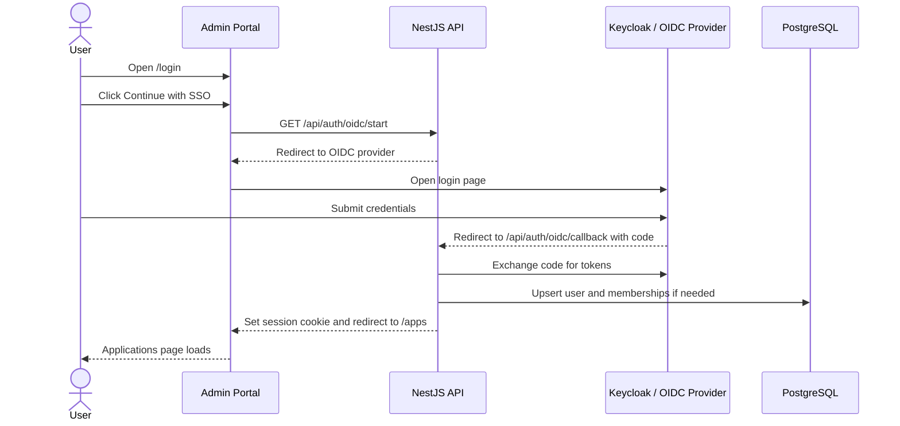
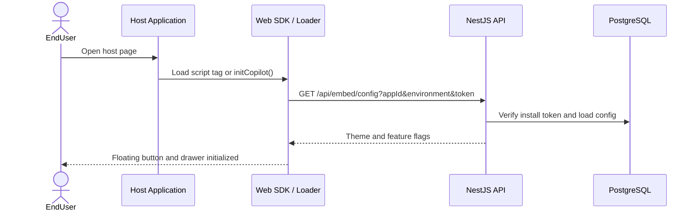
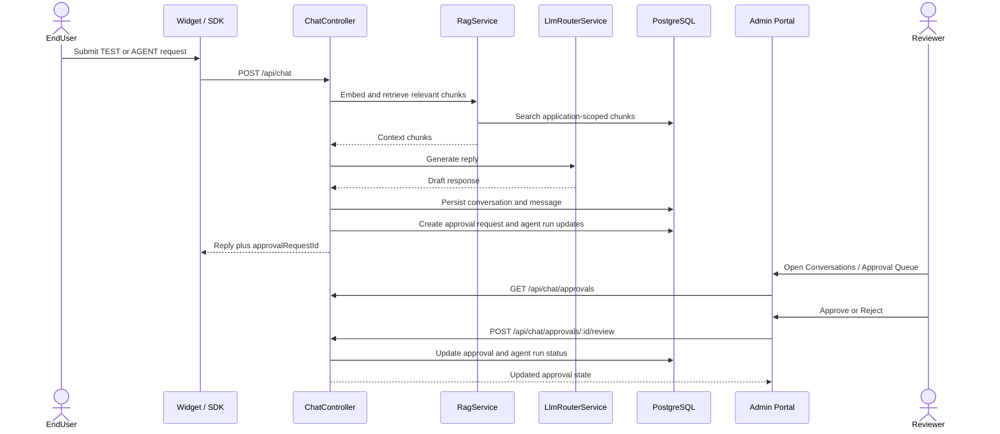

# Key sequence flows

This chapter explains the three most important runtime flows using sequence diagrams.

## 1. Admin login through OIDC

## 2. Widget bootstrap with install token

## 3. Chat request with approval lifecycle

## Why these flows matter

These three flows cover the majority of the platform behavior a new engineer needs to understand:

- how operators get into the system
- how the widget boots inside a customer application
- how the AI runtime, approvals, and operations UI connect together
