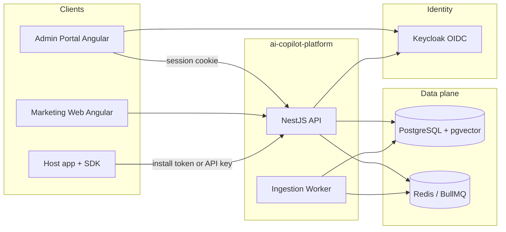

# System architecture

## Purpose

AI Copilot is a **multi-tenant** platform that lets enterprises:

- Register **organizations** and **applications** (hosted products).
- Configure **data sources** (repo/docs), run **ingestion**, and store **chunks + embeddings** in PostgreSQL (**pgvector**).
- Expose a **chat** API with **retrieval-augmented generation (RAG)**, pluggable **LLM providers**, and optional **human approval** for elevated modes.
- Operate an **admin portal** (Angular) for onboarding, configuration, usage, ingestion status, audit, conversations, and approvals.
- Ship a **marketing** site (Angular) and **embeddable SDKs** (web loader + npm packages) for host applications.

## High-level diagram

## Core runtime flows

1. **Admin users** authenticate via **developer login** (local) or **OIDC SSO** (Keycloak or enterprise IdP). Session cookies protect admin API routes.
2. **Embedded widget** calls **public** chat and embed endpoints using an **install token** + **environment** (and optional **domain allowlist**), or **application API keys** for server-style callers.
3. **Chat** persists **conversations/messages**, runs **RAG retrieval** (vector search over ingested chunks), routes to **LLM providers**, records **usage events**, and creates **approval requests** for `test` and `agent` modes.
4. **Ingestion** enqueues jobs on **Redis**; the **ingestion worker** processes sources, writes documents/chunks/embeddings.

## Key non-functional properties

- **Global API prefix**: all HTTP routes are under `/api` (for example `/api/health`, `/api/chat`).
- **Observability**: Prometheus metrics at `/api/metrics`, structured HTTP timing middleware with `x-request-id`.
- **Rate limiting**: optional per-application chat rate limits (Redis-backed) with standard rate-limit response headers.

## Related chapters

- [Monorepo & services map](../platform/source-layout.md)
- [Chat, RAG, LLM & approvals](../features/chat-rag-approvals.md)
