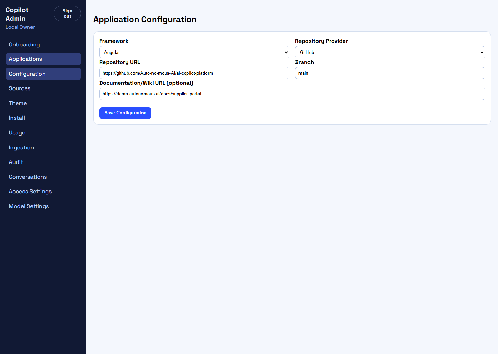
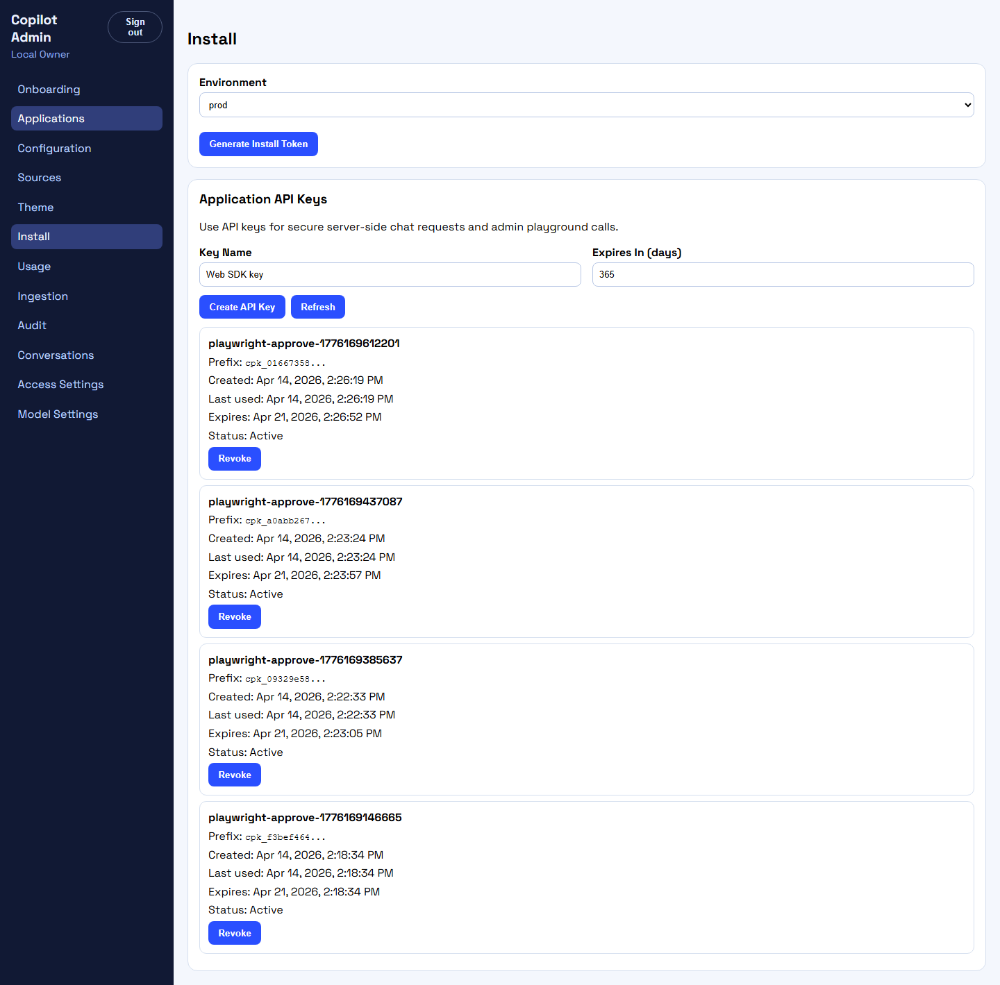
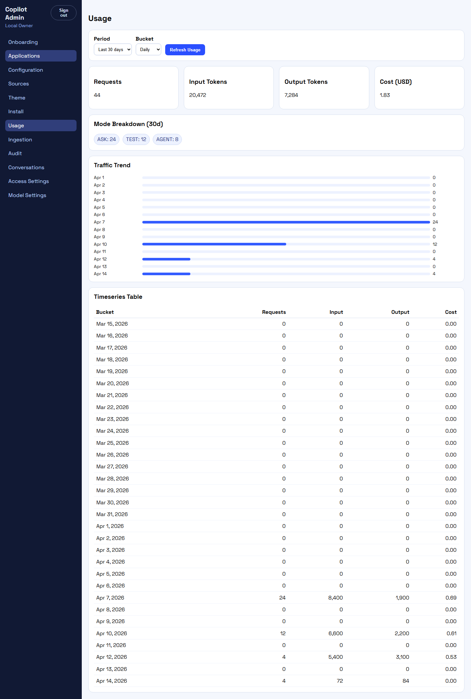

# Local demo walkthrough

This chapter explains exactly what a developer should inspect after the local environment is running.

Use it together with [Run locally step by step](run-locally-step-by-step.md).

## Demo sign-in

Sign in with:

- email: `owner@local.autonomous.ai`
- password: `Copilot123!`

After login, you should land on the Applications page.

## Applications landing experience

The screenshot below shows the live local demo after sign-in, including the three seeded applications.


## Seeded applications and what each one proves

### 1. Supplier Portal Copilot

Framework: `angular`

This app demonstrates:

- the primary Angular host scenario
- docs and repo ingestion examples
- a pending AGENT approval
- usage, audit, and conversation data tied to a realistic enterprise portal

Use it when you want to understand the full happy path for the product.

### 2. Procurement Operations Copilot

Framework: `react`

This app demonstrates:

- a React host scenario
- tenant credential and model-related operational events
- a completed AGENT run
- approval history that was already approved

Use it when you want to understand model routing and operational workflows.

### 3. Claims Review Copilot

Framework: `vanilla`

This app demonstrates:

- a plain JavaScript host scenario
- stricter approval and audit expectations
- a rejected approval path
- ingestion and policy guidance with stronger manual sign-off expectations

Use it when you want to inspect safety-oriented flows.

## Applications page

Open:

`/apps`

What to verify:

- all three demo apps are listed
- each app shows the expected framework
- you can open the quick links into deeper pages

Why it matters:

This confirms the user session, org membership lookup, and apps listing API are all working.

## Configuration page

Open:

`/apps/:id/configuration`

What to verify:

- repository provider is GitHub
- repository URL points to `https://github.com/Auto-no-mous-AI/ai-copilot-platform`
- branch is `main`
- docs URL is present
- feature flags for `ask`, `test`, and `agent` reflect the seeded application

Why it matters:

This is where a real tenant defines what the copilot should know and how it should behave.



## Sources page

Open:

`/apps/:id/sources`

What to verify:

- both repo and docs sources exist for the seeded apps
- source URLs match the seeded scenario
- reindex is available

Why it matters:

This is the main UI for ingestion inputs.

## Theme page

Open:

`/apps/:id/theme`

What to verify:

- each app has a distinct primary color
- icon, drawer width, and placement match the seeded theme

Example seeded differences:

- Supplier Portal Copilot uses a blue theme with a 420px drawer
- Procurement Operations Copilot uses a green theme with a 460px drawer
- Claims Review Copilot uses a darker red theme with a 400px drawer

Why it matters:

This is the runtime appearance the embed config exposes to the widget.

## Install page

Open:

`/apps/:id/install`

What to verify:

- install token creation works
- script snippet is generated
- npm snippet is generated
- environment-specific token generation works

Why it matters:

This is the handoff point between the platform and a tenant host application.



## Usage page

Open:

`/apps/:id/usage`

What to verify:

- aggregate request metrics load
- mode breakdown is visible
- traffic trend is visible

What the demo data shows:

- seeded request totals over several days
- separate ASK, TEST, and AGENT activity
- cost and volume trends

Why it matters:

This validates usage events, aggregation, and timeseries APIs.



## Ingestion page

Open:

`/apps/:id/ingestion`

What to verify:

- overall ingestion summary loads
- per-source section loads
- recent failures are visible when seeded

What the demo data shows:

- successful jobs
- running jobs
- queued jobs
- failed jobs with realistic reasons such as rate limiting or webhook timeouts

Why it matters:

This validates the operations surface for repo and docs ingestion.


## Audit page

Open:

`/apps/:id/audit`

What to verify:

- recent audit actions are visible
- actor and target metadata render correctly

Seeded examples include:

- configuration updates
- source reindex requests
- domain allowlist updates
- credential updates
- approval rejections

Why it matters:

This proves the platform is recording sensitive admin actions.


## Conversations page

Open:

`/apps/:id/conversations`

What to verify:

- conversations list loads
- messages load when you select a conversation
- citations are visible
- agent runs and steps are visible when present
- the approval queue section loads

Why it matters:

This page is the best single operational view into chat behavior, agent lifecycle, and human approvals.


## Approval queue walkthrough

The seed data already gives you useful examples:

- Supplier Portal Copilot: pending approval
- Procurement Operations Copilot: approved approval history
- Claims Review Copilot: rejected approval history

To create fresh approvals dynamically, run:

```powershell
pnpm smoke:first:ui:approvals
```

This creates new TEST and AGENT approvals, then reviews them through the admin UI.

## Access settings

Open:

`/settings/access`

What to verify:

- the seeded team members are visible
- roles map cleanly to owner, admin, developer, and viewer

Seeded team examples include:

- `owner@local.autonomous.ai`
- `engineering.lead@local.autonomous.ai`
- `qa.manager@local.autonomous.ai`
- `procurement.ops@local.autonomous.ai`

Why it matters:

This validates organization membership and role-management APIs.

## Model settings

Open:

`/settings/models`

What to verify:

- model routes are visible
- provider metadata can be managed

Why it matters:

This is the entry point for platform-managed model routing and provider selection.

## Suggested screenshots for onboarding

If you want to make the runbook even easier for new developers, capture screenshots for these views:

- Applications list with all three demo apps visible
- Supplier Portal Copilot configuration page
- Usage page showing mode breakdown and traffic trend
- Ingestion page showing recent failures
- Audit page showing seeded admin actions
- Conversations page with approval queue visible
- Install page showing the script and npm snippets
- Keycloak login page and post-login landing on `/apps`

These are the most helpful visuals for onboarding because they connect the seeded demo data to the real product screens.

## What a developer should understand after this walkthrough

By the end of this walkthrough, a developer should understand:

- how tenants and applications are represented
- where data sources come from
- how ingestion and retrieval connect to chat
- how approvals are surfaced operationally
- how install tokens and API keys are generated
- how the seeded scenarios map to Angular, React, and vanilla host applications
