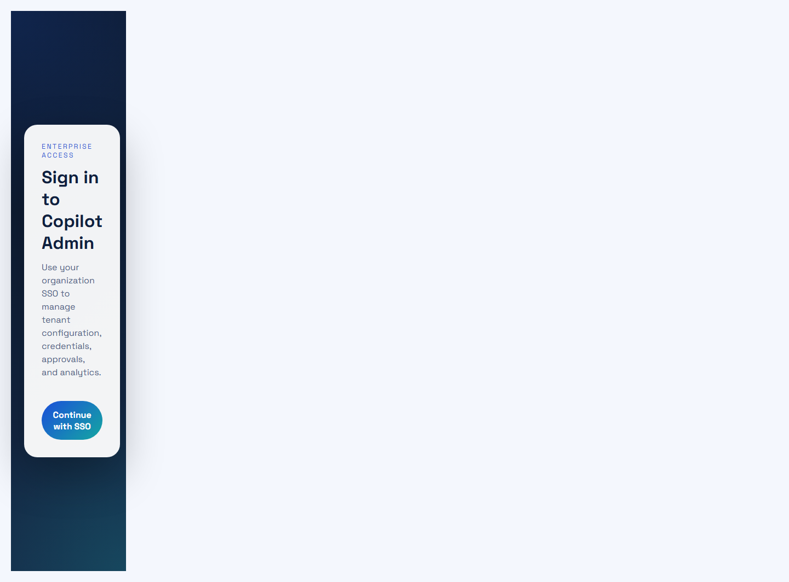
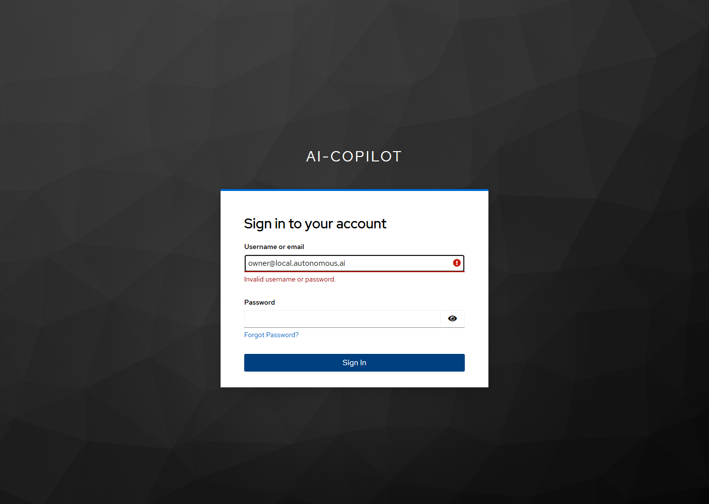
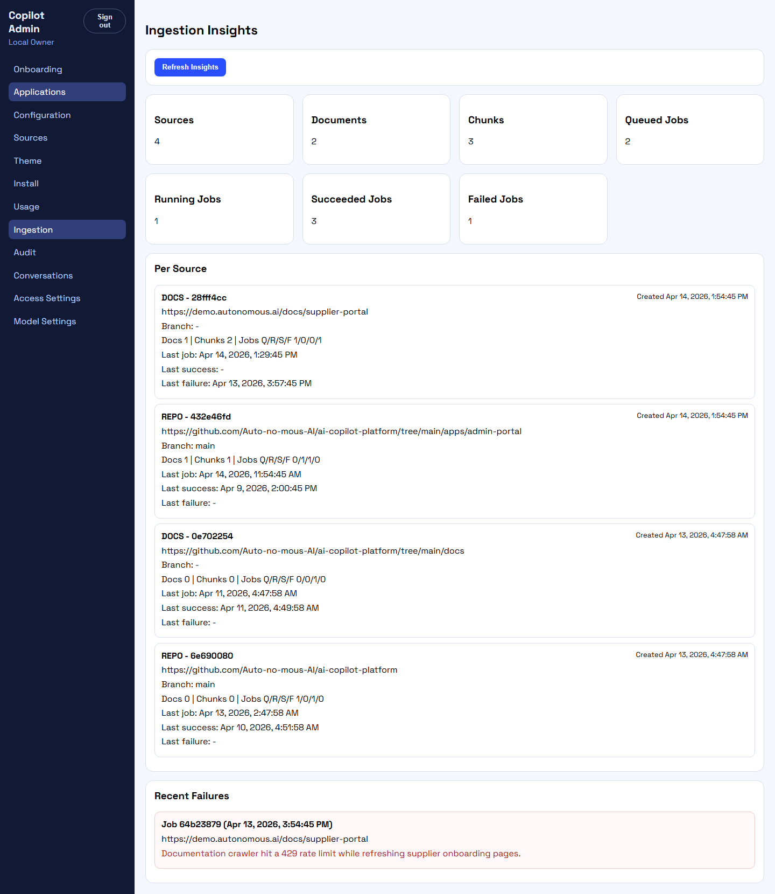
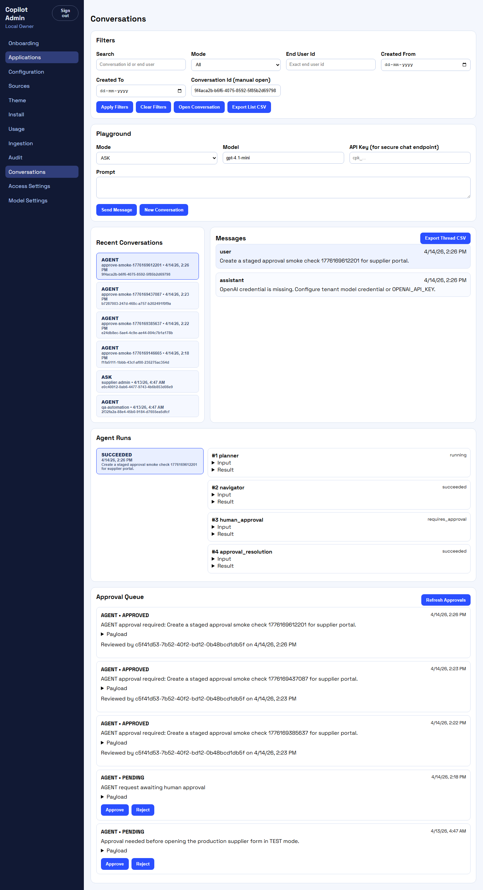
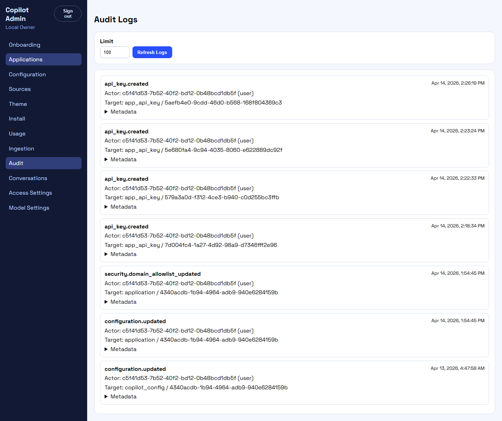
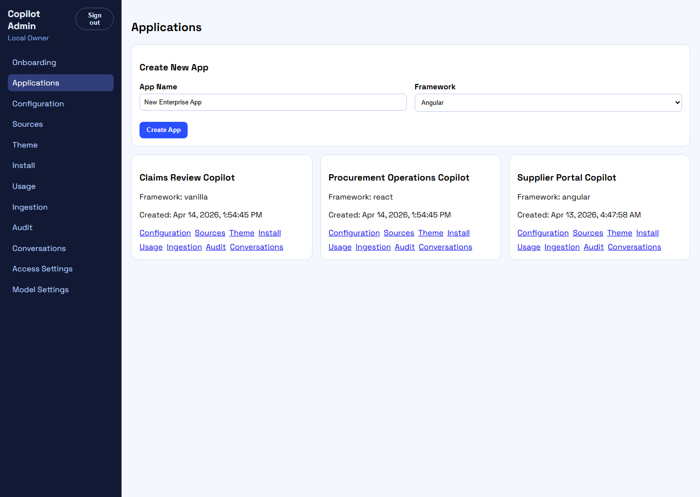

# Troubleshooting gallery

This chapter gives developers and operators a fast visual map of common local and demo-environment problems.

Use it together with [Run locally step by step](../getting-started/run-locally-step-by-step.md) and [Deployment and operations](deployment-operations.md).

## 1. You are back on the admin login page

Symptom:

- you expected the admin app, but you see the login screen again

Typical causes:

- no session cookie exists
- the session expired
- you opened the app in a fresh browser profile
- the API auth flow is not completing

What to check:

1. open `http://127.0.0.1:3000/api/auth/config`
2. confirm the API is reachable and auth config loads
3. confirm Keycloak is reachable at `http://127.0.0.1:8080`
4. retry the SSO flow from the login button



## 2. Keycloak says invalid username or password

Symptom:

- the OIDC login form rejects the credentials

Typical causes:

- wrong password entered
- the first environment was regenerated and the previous credentials are stale
- the local Keycloak realm import is out of sync with `.env.first.local`

What to check:

1. use the generated demo credentials:
   - `owner@local.autonomous.ai`
   - `Copilot123!`
2. rerun `pnpm env:first` if you intentionally rebuilt the local environment from scratch
3. rerun `pnpm deploy:first:up` so Keycloak client sync runs again



## 3. Ingestion page shows recent failures

Symptom:

- the ingestion page loads, but the recent failures section contains failed jobs

Typical causes:

- docs source returned rate limits or errors
- repository sync failed
- branch or credentials are wrong
- source content moved or became unavailable

What to check:

1. open the app Ingestion page
2. inspect the Recent Failures section
3. verify source URL, branch, and credentials
4. queue a fresh reindex if the source has been corrected



## 4. Approval queue is full or a run is paused

Symptom:

- chat or agent work looks stalled
- the conversation view shows pending approvals or runs waiting for approval

Typical causes:

- TEST or AGENT mode created an approval request
- no reviewer has approved or rejected the request yet
- an operator is expecting autonomous progress without checking the approval queue

What to check:

1. open the Conversations page for the affected app
2. review the Approval Queue section
3. inspect the corresponding agent run and steps
4. approve or reject the item intentionally



## 5. Audit entries look missing after a change

Symptom:

- a change happened, but you do not see the expected audit record

Typical causes:

- the action was not one of the audited flows yet
- you are checking the wrong application
- the mutation failed before the audit write path completed

What to check:

1. open the Audit page for the correct app
2. confirm the action actually succeeded
3. inspect the matching API/controller path in `services/api/src`
4. verify `recordAuditLog` is called for that mutation path



## 6. Applications list looks empty or incomplete

Symptom:

- the Applications page does not show the expected demo apps

Typical causes:

- demo tenant was not seeded
- you are signed in as a user without the expected membership
- the database was reset after the previous seed run

What to check:

1. rerun `pnpm seed:first:demo`
2. rerun `pnpm smoke:first:env`
3. confirm the authenticated user is `owner@local.autonomous.ai`

Expected healthy state:



## Fast recovery commands

For the most common local issues, this sequence is safe and fast:

```powershell
pnpm deploy:first:up
pnpm seed:first:demo
pnpm smoke:first:env
pnpm smoke:first:ui
pnpm smoke:first:ui:approvals
```

If Docker state is badly out of date, bring the environment down first:

```powershell
pnpm deploy:first:down
pnpm deploy:first:up
```
